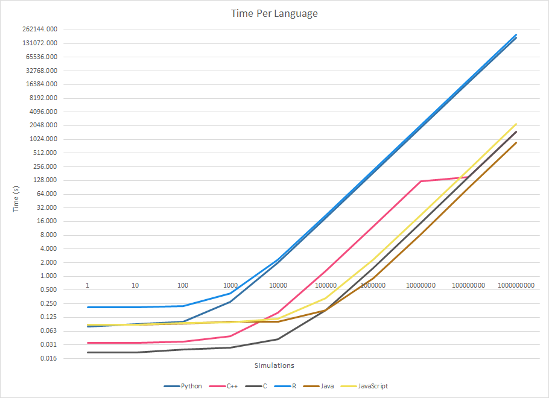

# Monopoly

### A collection of Monopoly simulators.

I originally wrote this in Python to determine the best properties to own.
However, I realized that this is a good way to test the speed of a language.

## Comparison
| Games | Python     | C++      | C        | R          | Java     |
| ----- | ---------- | -------- | -------- | ---------- | -------- |
| 1     | 0.079      | 0.035    | 0.021    | 0.210      | 0.086    |
| 10    | 0.090      | 0.035    | 0.022    | 0.210      | 0.092    |
| 100   | 0.102      | 0.037    | 0.025    | 0.225      | 0.101    |
| 1K    | 0.275      | 0.049    | 0.027    | 0.420      | 0.101    |
| 10K   | 1.980      | 0.159    | 0.041    | 2.360      | 0.179    |
| 100K  | 19.179     | 1.325    | 0.179    | 21.353     | 0.898    |
| 1M    | 189.324    | 12.571   | 1.538    | 212.512    | 8.310    |
| 10M   | 1856.412   | 124.340  | 15.030   | 2100.721   | 87.869   |
| 100M  | 18249.450  | 151.021  | 150.588  | 20817.646  | 879.224  |
| 1B    | 177254.697 | 1505.779 | 1491.434 | 203816.674 | 8800.246 |

